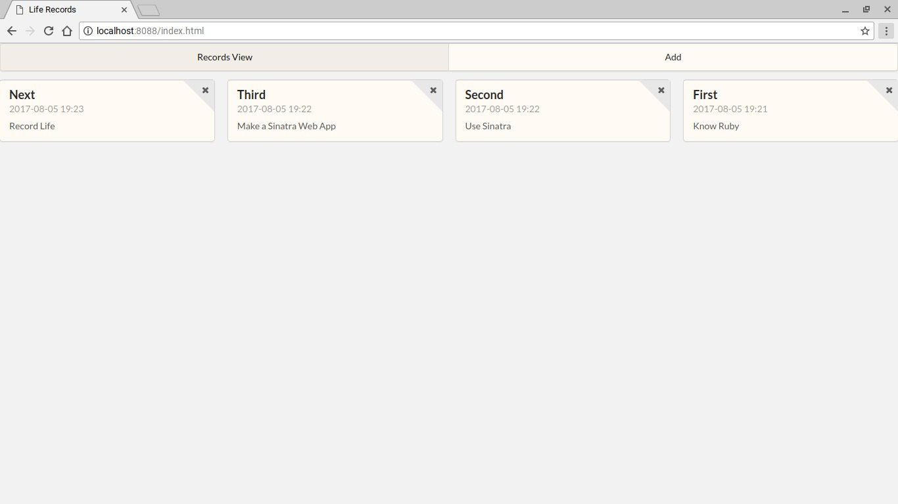
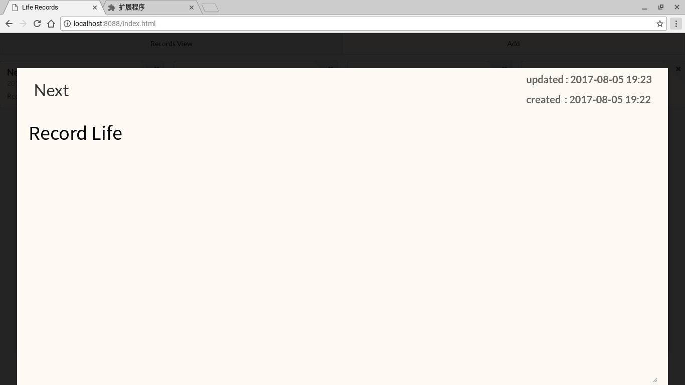

## Notes App - Sinatra  Demo  
Sinatra + ActiveRecord + Sqlite3
### Install Ruby and Sinatra
For example, on Ubuntu 12.04
```shell
$sudo apt-get update
$sudo apt-get install curl
$\curl -L https://get.rvm.io | bash -s stable
$source ~/.rvm/scripts/rvm
$rvm requirements
$rvm install ruby
$rvm use ruby --default
$rvm rubygems current
$gem install sinatra
$gem install thin
$gem install bundle
```

To start using RVM you need to run `source '$HOME/.rvm/scripts/rvm` first(even you reopen a new terminal),then you can use ruby command.

You can add the following line:  
```
[[ -s "$HOME/.rvm/scripts/rvm" ]] && . "$HOME/.rvm/scripts/rvm"  
```
in `.profile` file or `.bashrc` located in your home directory (`~/.profile` or `~/.bashrc`)   

This will load up rvm into a bash session so you don't have to manually type it every time.


### Run App
```shell
$git clone https://github.com/uxov/NotesApp.git
$cd lifeRecord
$bundle install
$ruby app.rb

```
### And view in browser: [http://localhost:8088](http://localhost:8088)  
### Screenshot
  


---
[Sinatra Getting Started](http://www.sinatrarb.com/intro.html)  
[Sinatra/ActiveRecord/sqlite3 App](https://github.com/shannonjen/sinatra_crud_tutorial)
